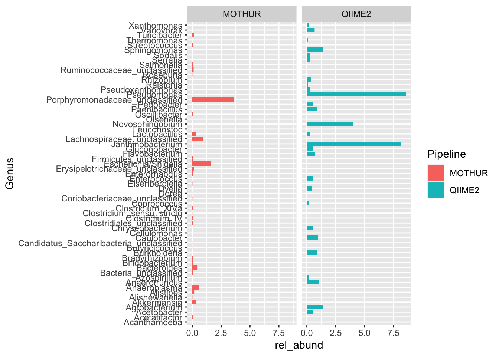

# (PART) EXPLORATION STEPS {-}

# Getting Started with Data Exploration
## Understand Snakemake Workflows
In this section, provide a brief introduction to Snakemake, highlighting its role in creating reproducible and scalable data workflows. Emphasize how Snakemake facilitates the integration of multiple scripting languages for a unified and efficient data exploration process.

## Setting Up Exploration Environment
Guide readers through the process of setting up the environment for Snakemake workflows. Include instructions on installing Snakemake, creating a virtual environment, and managing dependencies for R and Python scripts. Offer code snippets and examples for better clarity.

## Basics of Snakemake Rules
Explain the fundamental concepts of Snakemake rules, including input, output, and shell commands. Use a simple example related to taxa abundance data to illustrate how to define a basic rule for generating barplots.

<div class="infoicon">
<p>rule create_barplots input: “data/mothur_composite.csv”,
“data/qiime2_composite.csv” output: “figures/taxon_barplot.png”
“figures/taxon_barplot.svg” shell: “Rscript scripts/create_barplots.R
{input} {output}”</p>
</div>

## Integrating R, Python, and Bash
Demonstrate how to integrate R, Python, and Bash scripts within Snakemake rules. Showcase examples where each scripting language contributes to the overall data exploration workflow. Highlight the versatility of Snakemake in orchestrating these diverse components.

# Data Exploration Techniques
Cover a range of data exploration techniques applicable to taxa abundance data. Discuss statistical analysis, visualization, and exploratory data analysis concepts. Introduce the specific analysis goals and outline how they will be achieved using integrated Snakemake workflows.

# Visualizations with R and Python:
Delve deeper into the visualization aspect, providing detailed examples of creating barplots using ggplot2 (R) and seaborn/matplotlib (Python). Include code snippets, explain parameters, and showcase resulting visualizations.

<!-- ```{block, type="infoicon", echo=TRUE} -->

```r
# scripts/create_barplots.R
library(dplyr)
```

```
## 
## Attaching package: 'dplyr'
```

```
## The following objects are masked from 'package:stats':
## 
##     filter, lag
```

```
## The following objects are masked from 'package:base':
## 
##     intersect, setdiff, setequal, union
```

```r
library(readr)
library(ggplot2)
library(svglite)

mo <- read_csv("data/mothur_composite.csv", show_col_types = FALSE) %>% 
  mutate(pipeline="MOTHUR", .before=2) %>% 
  select(-otu, -3)

q2 <- read_csv("data/qiime2_composite.csv", show_col_types = FALSE) %>% 
  mutate(pipeline="QIIME2", .before=2) %>% 
  select(-feature, -c(3:14))

rbind(mo, q2) %>% 
  group_by(sample_id) %>%
  mutate(total = sum(count)) %>%
  filter(total > 0) %>%
  group_by(Genus) %>%
  mutate(total = sum(count)) %>%
  # filter(total != 0) %>%
  filter(total >= 10) %>%
  ungroup() %>%
  select(-total) %>% 
  ggplot(aes(x=Genus, y=rel_abund, fill=pipeline)) +
  facet_grid(~pipeline) +
  geom_col() +
  coord_flip() +
  labs(fill="Pipeline")
```



```r
ggsave(file="figures/taxon_barplot.png", width=10, height=10)
ggsave(file="figures/taxon_barplot.svg", width=10, height=10)
```

# Advanced Snakemake Features
Explore advanced Snakemake features that enhance workflow efficiency. Discuss dynamic rules, wildcard constraints, and conditional execution. Showcase how these features can be applied to optimize the data exploration workflow.

# Case Studies and Examples
Present real-world case studies demonstrating the application of Snakemake in the context of taxa abundance data. Include examples that showcase the synergy of R, Python, and Bash scripts for comprehensive data exploration.

## Best Practices and Optimization
Provide best practices for optimizing Snakemake workflows, emphasizing efficiency and reproducibility. Address common challenges and suggest strategies for effective workflow design in the context of data exploration.

# Conclusion
Summarize key takeaways, highlighting the benefits of an integrated Snakemake workflow for data exploration. Encourage readers to apply the demonstrated techniques to their own research projects.
