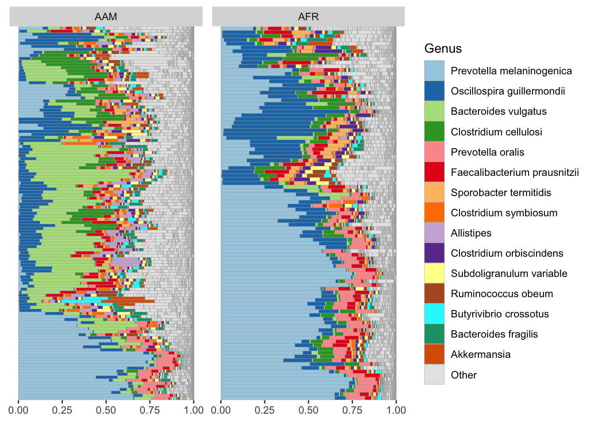

# (PART) VISUALIZATION TYPES {-}

# Type of Visualization of Microbiome Data {#visual-types}


```r
knitr::opts_chunk$set(
  echo  =TRUE,
  message  =FALSE,
  warning  =FALSE,
  cache  =FALSE,
  comment  =NA)
```


## Import preprocessed data

```r
# Load required packages
library(phyloseq)
library(tidyverse)

cat("\nSaved RData objects\n\n")
```

```

Saved RData objects
```

```r
load("../imap-data-preparation/data/phyloseq_objects.rda", verbose = T)
```

```
Loading objects:
  df_GlobalPatterns
  df_dietswap
  df_caporaso
  df_kostic_crc
  ps_GlobalPatterns
  ps_dietswap
  ps_caporaso
  ps_kostic_crc
```

```r
load("../imap-data-preparation/data/ps_transformed.rda", verbose = T)
```

```
Loading objects:
  ps_asin
  ps_identity
  ps_compositional
  ps_z_otu
  ps_z_sample
  ps_log10
  ps_log10p
  ps_clr
  ps_shift
  ps_scale
```

```r
load("../imap-data-preparation/data/bray_distances.rda", verbose = T)
```

```
Loading objects:
  ps_asin_bray_dist
  ps_compositional_bray_dist
  ps_z_otu_bray_dist
  ps_z_sample_bray_dist
  ps_log10_bray_dist
  ps_log10p_bray_dist
  ps_clr_bray_dist
  ps_shift_bray_dist
  ps_scale_bray_dist
```

## Overview of microbiome demo data

Now that we have imported the microbiome data into R environment, let us get an overview of these microbiome demo data. We will examine the dimensions of the OTU table within the dataset to understand the available information.


```r
# Load required packages
library(phyloseq)

cat("\nDimensions of the OTU table in the GlobalPatterns dataset\n")
```

```

Dimensions of the OTU table in the GlobalPatterns dataset
```

```r
dim(otu_table(ps_GlobalPatterns))
```

```
[1] 19216    26
```

```r
cat("\nColumn names of ps_GlobalPatterns dataset\n")
```

```

Column names of ps_GlobalPatterns dataset
```

```r
colnames(otu_table(ps_GlobalPatterns))
```

```
 [1] "CL3"      "CC1"      "SV1"      "M31Fcsw"  "M11Fcsw"  "M31Plmr" 
 [7] "M11Plmr"  "F21Plmr"  "M31Tong"  "M11Tong"  "LMEpi24M" "SLEpi20M"
[13] "AQC1cm"   "AQC4cm"   "AQC7cm"   "NP2"      "NP3"      "NP5"     
[19] "TRRsed1"  "TRRsed2"  "TRRsed3"  "TS28"     "TS29"     "Even1"   
[25] "Even2"    "Even3"   
```

```r
cat("\nDimensions of the OTU table in the dietswap dataset\n") 
```

```

Dimensions of the OTU table in the dietswap dataset
```

```r
dim(otu_table(ps_dietswap))
```

```
[1] 130 222
```

```r
cat("\nColumn names of ps_dietswap dataset\n")
```

```

Column names of ps_dietswap dataset
```

```r
colnames(otu_table(ps_dietswap))
```

```
  [1] "Sample-1"   "Sample-2"   "Sample-3"   "Sample-4"   "Sample-5"  
  [6] "Sample-6"   "Sample-7"   "Sample-8"   "Sample-9"   "Sample-10" 
 [11] "Sample-11"  "Sample-12"  "Sample-13"  "Sample-14"  "Sample-15" 
 [16] "Sample-16"  "Sample-17"  "Sample-18"  "Sample-19"  "Sample-20" 
 [21] "Sample-21"  "Sample-22"  "Sample-23"  "Sample-24"  "Sample-25" 
 [26] "Sample-26"  "Sample-27"  "Sample-28"  "Sample-29"  "Sample-30" 
 [31] "Sample-31"  "Sample-32"  "Sample-33"  "Sample-34"  "Sample-35" 
 [36] "Sample-36"  "Sample-37"  "Sample-38"  "Sample-39"  "Sample-40" 
 [41] "Sample-41"  "Sample-42"  "Sample-43"  "Sample-44"  "Sample-45" 
 [46] "Sample-46"  "Sample-47"  "Sample-48"  "Sample-49"  "Sample-50" 
 [51] "Sample-51"  "Sample-52"  "Sample-53"  "Sample-54"  "Sample-55" 
 [56] "Sample-56"  "Sample-57"  "Sample-58"  "Sample-59"  "Sample-60" 
 [61] "Sample-61"  "Sample-62"  "Sample-63"  "Sample-64"  "Sample-65" 
 [66] "Sample-66"  "Sample-67"  "Sample-68"  "Sample-69"  "Sample-70" 
 [71] "Sample-71"  "Sample-72"  "Sample-73"  "Sample-74"  "Sample-75" 
 [76] "Sample-76"  "Sample-77"  "Sample-78"  "Sample-79"  "Sample-80" 
 [81] "Sample-81"  "Sample-82"  "Sample-83"  "Sample-84"  "Sample-85" 
 [86] "Sample-86"  "Sample-87"  "Sample-88"  "Sample-89"  "Sample-90" 
 [91] "Sample-91"  "Sample-92"  "Sample-93"  "Sample-94"  "Sample-95" 
 [96] "Sample-96"  "Sample-97"  "Sample-98"  "Sample-99"  "Sample-100"
[101] "Sample-101" "Sample-102" "Sample-103" "Sample-104" "Sample-105"
[106] "Sample-106" "Sample-107" "Sample-108" "Sample-109" "Sample-110"
[111] "Sample-111" "Sample-112" "Sample-113" "Sample-114" "Sample-115"
[116] "Sample-116" "Sample-117" "Sample-118" "Sample-119" "Sample-120"
[121] "Sample-121" "Sample-122" "Sample-123" "Sample-124" "Sample-125"
[126] "Sample-126" "Sample-127" "Sample-128" "Sample-129" "Sample-130"
[131] "Sample-131" "Sample-132" "Sample-133" "Sample-134" "Sample-135"
[136] "Sample-136" "Sample-137" "Sample-138" "Sample-139" "Sample-140"
[141] "Sample-141" "Sample-142" "Sample-143" "Sample-144" "Sample-145"
[146] "Sample-146" "Sample-147" "Sample-148" "Sample-149" "Sample-150"
[151] "Sample-151" "Sample-152" "Sample-153" "Sample-154" "Sample-155"
[156] "Sample-156" "Sample-157" "Sample-158" "Sample-159" "Sample-160"
[161] "Sample-161" "Sample-162" "Sample-163" "Sample-164" "Sample-165"
[166] "Sample-166" "Sample-167" "Sample-168" "Sample-169" "Sample-170"
[171] "Sample-171" "Sample-172" "Sample-173" "Sample-174" "Sample-175"
[176] "Sample-176" "Sample-177" "Sample-178" "Sample-179" "Sample-180"
[181] "Sample-181" "Sample-182" "Sample-183" "Sample-184" "Sample-185"
[186] "Sample-186" "Sample-187" "Sample-188" "Sample-189" "Sample-190"
[191] "Sample-191" "Sample-192" "Sample-193" "Sample-194" "Sample-195"
[196] "Sample-196" "Sample-197" "Sample-198" "Sample-199" "Sample-200"
[201] "Sample-201" "Sample-202" "Sample-203" "Sample-204" "Sample-205"
[206] "Sample-206" "Sample-207" "Sample-208" "Sample-209" "Sample-210"
[211] "Sample-211" "Sample-212" "Sample-213" "Sample-214" "Sample-215"
[216] "Sample-216" "Sample-217" "Sample-218" "Sample-219" "Sample-220"
[221] "Sample-221" "Sample-222"
```

```r
cat("\nDimensions of the OTU table in the caporaso dataset\n") 
```

```

Dimensions of the OTU table in the caporaso dataset
```

```r
dim(otu_table(ps_caporaso))
```

```
[1] 3426   34
```

```r
cat("\nColumn names of ps_caporaso dataset\n") 
```

```

Column names of ps_caporaso dataset
```

```r
colnames(otu_table(ps_caporaso))
```

```
 [1] "L1S140" "L1S208" "L1S8"   "L1S281" "L3S242" "L2S309" "L2S357" "L4S112"
 [9] "L2S155" "L2S382" "L4S63"  "L2S222" "L3S341" "L3S360" "L2S204" "L4S137"
[17] "L3S294" "L2S175" "L5S203" "L6S93"  "L6S20"  "L6S68"  "L1S257" "L3S378"
[25] "L1S105" "L5S174" "L5S155" "L5S222" "L5S104" "L1S57"  "L1S76"  "L5S240"
[33] "L3S313" "L2S240"
```

```r
cat("\nDimensions of the OTU table in the kostic_crc dataset\n") 
```

```

Dimensions of the OTU table in the kostic_crc dataset
```

```r
dim(otu_table(ps_kostic_crc))
```

```
[1] 2505  177
```

```r
cat("\nColumn names of kostic_crc dataset\n") 
```

```

Column names of kostic_crc dataset
```

```r
colnames(otu_table(ps_kostic_crc))
```

```
  [1] "C0333.N.518126"  "C0333.T.518046"  "38U4VAHB.518100" "XZ33PN7O.518030"
  [5] "GQ6LSNI6.518106" "C0270.N.518041"  "HZIMMAM6.518095" "LRQ9WN6C.518048"
  [9] "A8A34NCW.518023" "C0332.N.518027"  "C10.S.517995"    "MQE9ONGV.518038"
 [13] "C0230.N.517992"  "C0256.N.518170"  "HZIMMNL5.518062" "GQ6LSABJ.518010"
 [17] "C0282.N.518138"  "TV28INUO.518004" "C0315.N.518021"  "C0235.N.517993" 
 [21] "5TA9VN6K.518161" "A8A34AP9.518086" "UEL2GAPI.518173" "O436FAO8.518097"
 [25] "C0378.N.518158"  "41E1KNBP.517985" "C0378.T.518104"  "R8J9ZNOW.518040"
 [29] "R8J9ZAGC.518059" "5TA9VAT9.518088" "OTGGZAZO.518108" "C0269.N.518130" 
 [33] "C0271.T.518078"  "C0318.N.518105"  "C0159.T.518087"  "C0318.T.518140" 
 [37] "O436FNP3.518007" "C0209.N.517984"  "C0240.N.518020"  "C0306.N.518003" 
 [41] "MQETMNL4.518037" "C0209.T.518128"  "C0112.T.518024"  "C0355.T.518157" 
 [45] "C0322.N.518165"  "6G2KBNS6.518045" "C0240.T.518052"  "C0268.T.518114" 
 [49] "C0285.T.518044"  "41E1KAMA.517991" "QFHRSAG2.518005" "I7ROLN9P.518079"
 [53] "QFHRSNIH.518116" "C0271.N.518022"  "KIXFRARY.518160" "C0133.N.518051" 
 [57] "C0268.N.518089"  "OTGGZN5Y.518063" "C0134.N.518072"  "C0395.N.518054" 
 [61] "UZ65XAS5.518119" "C0311.T.518131"  "5EKFOAO4.518164" "C0294.T.518134" 
 [65] "C0388.N.518136"  "C0186.N.518143"  "38U4VNBW.518090" "C0334.T.518147" 
 [69] "JIDZEN4J.518073" "JIDZEAPD.518149" "LRQ9WAHA.518036" "UZ65XN27.518028"
 [73] "C0159.N.518042"  "C0306.T.518122"  "C0394.N.518031"  "C0342.N.518068" 
 [77] "82S3MAZ4.518145" "C4.T.518118"     "C0398.N.518152"  "C0388.T.518015" 
 [81] "C0285.N.518084"  "C0308.N.518154"  "C0355.N.518077"  "C0308.T.518162" 
 [85] "C0211.T.518096"  "C0206.N.518065"  "C0149.N.518039"  "C4.S.518169"    
 [89] "C0374.N.518099"  "C0362.N.518069"  "C0211.N.518117"  "G3UBQNDP.518121"
 [93] "C0341.N.518101"  "C1.T.518120"     "C0399.T.518153"  "C0294.N.517987" 
 [97] "C0186.T.518019"  "G2OD5N55.518146" "YOTV6ASH.518142" "C0258.T.517997" 
[101] "C0230.T.518144"  "C0315.T.518034"  "C0349.N.517989"  "C0212.N.518167" 
[105] "YOTV6NC8.518156" "C0112.N.518001"  "C0335.N.518107"  "C0344.N.518103" 
[109] "82S3MNBY.518050" "5EKFONB3.518125" "C0225.N.518047"  "C6.S.518082"    
[113] "C0241.N.518043"  "C1.S.518137"     "XBS5MNEH.518074" "C0195.N.518110" 
[117] "C0322.T.518018"  "C0342.T.518093"  "C0198.T.518166"  "C0395.T.518075" 
[121] "G3UBQAJU.518060" "C0335.T.518115"  "C0349.T.518111"  "C0149.T.518132" 
[125] "C0311.N.518124"  "C0154.N.518002"  "C0258.N.518014"  "C0371.N.518009" 
[129] "C0330.N.518148"  "C0344.T.518029"  "C0206.T.518053"  "C0371.T.518139" 
[133] "C0394.T.518064"  "C0332.T.518017"  "G2OD5ABL.518057" "C6.T.518061"    
[137] "C0256.T.518080"  "C0095.T.518141"  "C0252.T.518006"  "C0366.T.518172" 
[141] "C0241.T.518067"  "C0198.N.518081"  "C0330.T.518035"  "C0325.N.518109" 
[145] "C0225.T.518033"  "C0154.T.518091"  "C0366.N.518094"  "C0270.T.518163" 
[149] "MQETMAZC.518171" "C0095.N.518123"  "C0341.T.518113"  "C0252.N.518016" 
[153] "C0325.T.518083"  "C0212.T.518155"  "C0399.N.518011"  "C0334.N.518066" 
[157] "XZ33PA3O.518135" "KIXFRNL2.518129" "C0374.T.518127"  "C0275.N.518076" 
[161] "59S9WAIH.518013" "C0314.T.518025"  "6G2KBASQ.517999" "C0133.T.518133" 
[165] "UEL2GN92.518058" "59S9WNC6.518055" "C0235.T.518049"  "C0362.T.518026" 
[169] "TV28IANZ.518070" "C10.T.518056"    "C0275.T.518032"  "MQE9OAS7.518008"
[173] "32I9UAPQ.518112" "UTWNWANU.518168" "UTWNWN3P.518012" "BFJMKAKB.518159"
[177] "32I9UNA9.518098"
```


## Major microbiome data visualization techniques {#visual-types}
Microbiome data visualization plays a crucial role in understanding the complex interactions within microbial communities. Below are some of the key visualization techniques used in microbiome research, along with their descriptions and the corresponding tools in R and Python.


| Output Image | Description |
|-------|-------------|
| Barplots | Display the relative abundances of different taxa across groups. |
| Heatmaps | Represent the abundance or presence/absence of taxa across samples. |
| Scatter plots | Useful for visualizing relationships between numerical variables |
| Box plots | Summarize the distribution of a variable |
| PCA plots | Dimensionality reduction technique for visualizing similarities or dissimilarities between samples based on their microbial composition |
| Alpha diversity plots | Measure the diversity within a sample, e.g. rarefaction plot |
| Beta diversity plots | Measure the dissimilarity between samples, e.g. PCoA ordination |
| Line plot | Visualize changes in the abundance of specific taxa over time or across different conditions. |
| Network plots | Depict interactions or associations between taxa|
| Volcano plots | Identify statistically significant differences in abundance between groups |
| Correlation plots | Visualize correlations between taxa or between taxa and metadata variables |
| UpSet plots | Display intersections of sets and their size in a matrix layout |
| Venn diagrams | Show overlap between taxa or groups |
| Differential abundance plots | Visualize differences in abundance between groups while controlling for confounding factors |
| Indicator species analysis plots | Identify taxa associated with specific groups or conditions |


## Barplots by microViz package
Display the relative abundances of different taxa across groups


```r
library(microViz)
ps <- ps_dietswap
ps %>%
  comp_barplot(
    tax_level = "Genus", n_taxa = 15, other_name = "Other",
    taxon_renamer = function(x) stringr::str_remove(x, " [ae]t rel."),
    palette = distinct_palette(n = 15, add = "grey90"),
    merge_other = FALSE, bar_outline_colour = "#aaaaaa"
  ) +
  coord_flip() +
  facet_wrap("nationality", nrow = 1, scales = "free") +
  labs(x = NULL, y = NULL) +
  theme(axis.text.y = element_blank(), axis.ticks.y = element_blank())
```



![
