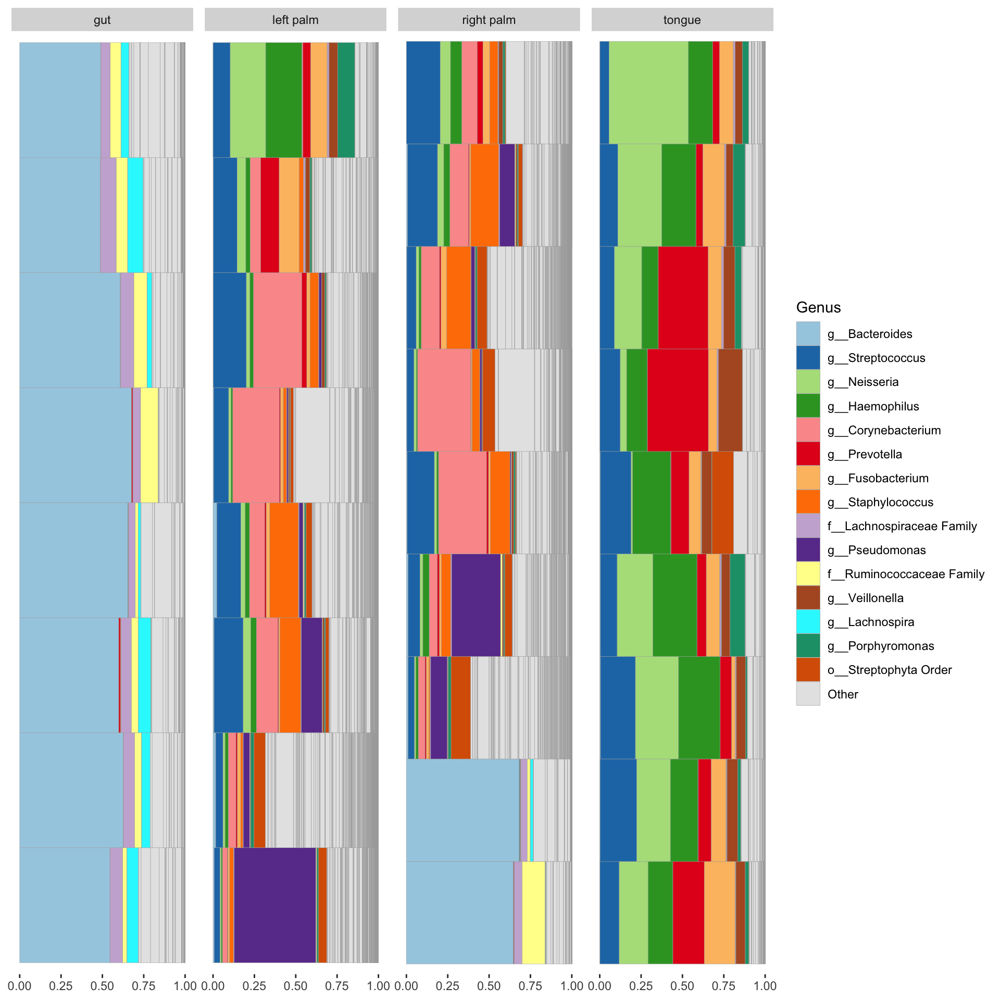
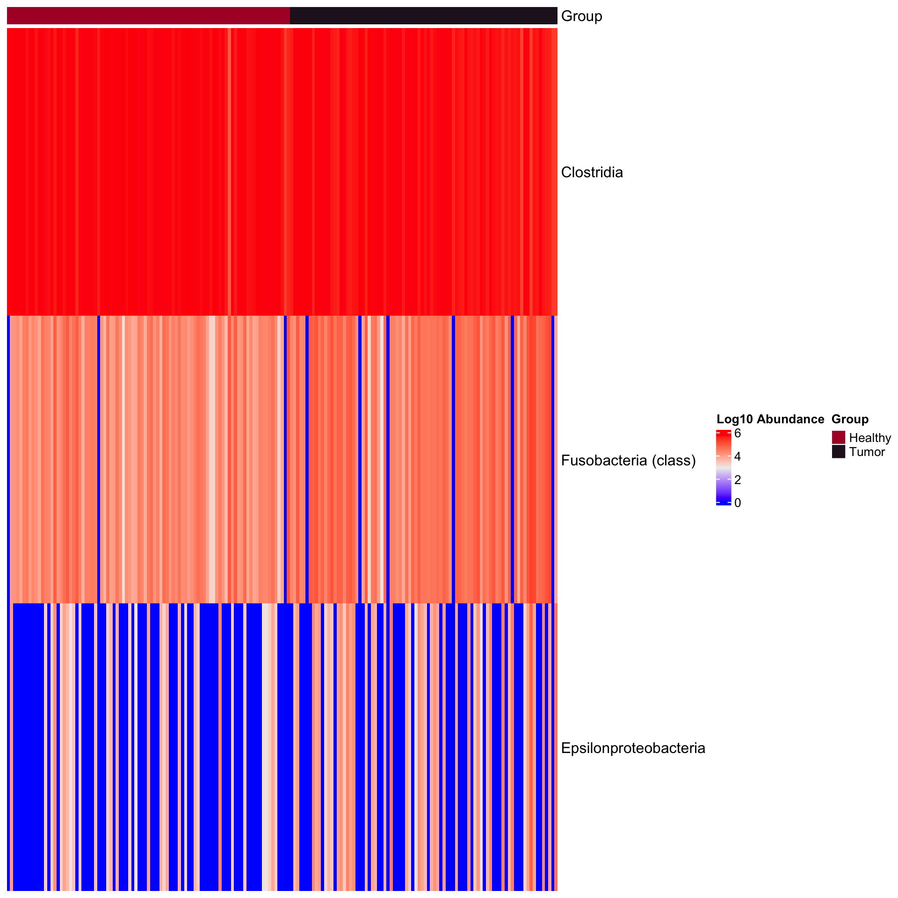
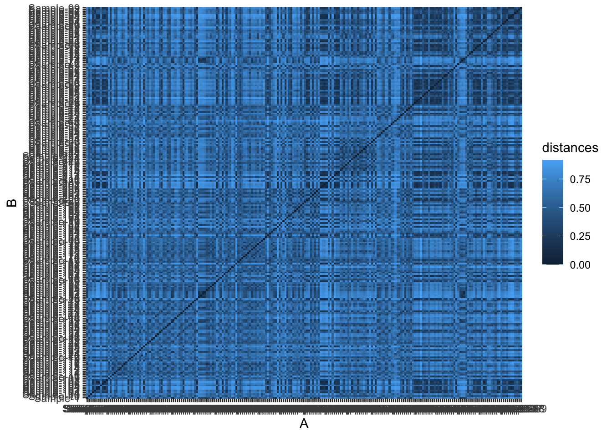
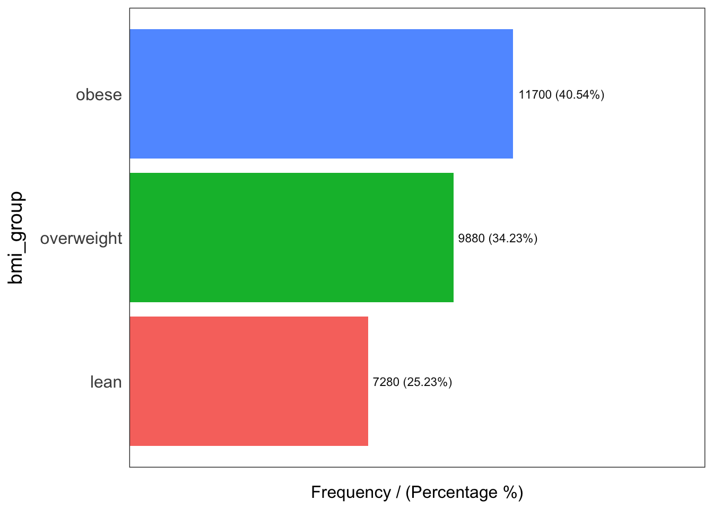

# Exploration of processded data
## Import data

```r
library(tidyverse)
```

```
## ── Attaching core tidyverse packages ──────────────────────── tidyverse 2.0.0 ──
## ✔ dplyr     1.1.4     ✔ readr     2.1.5
## ✔ forcats   1.0.0     ✔ stringr   1.5.1
## ✔ ggplot2   3.4.4     ✔ tibble    3.2.1
## ✔ lubridate 1.9.3     ✔ tidyr     1.3.1
## ✔ purrr     1.0.2     
## ── Conflicts ────────────────────────────────────────── tidyverse_conflicts() ──
## ✖ dplyr::filter() masks stats::filter()
## ✖ dplyr::lag()    masks stats::lag()
## ℹ Use the conflicted package (<http://conflicted.r-lib.org/>) to force all conflicts to become errors
```

```r
library(phyloseq)
```

```
## Warning in .recacheSubclasses(def@className, def, env): undefined subclass
## "ndiMatrix" of class "replValueSp"; definition not updated
```

```r
library(microbiome)
```

```
## 
## microbiome R package (microbiome.github.com)
##     
## 
## 
##  Copyright (C) 2011-2022 Leo Lahti, 
##     Sudarshan Shetty et al. <microbiome.github.io>
## 
## 
## Attaching package: 'microbiome'
## 
## The following object is masked from 'package:ggplot2':
## 
##     alpha
## 
## The following object is masked from 'package:base':
## 
##     transform
```

```r
library(microbiomeMarker)
```

```
## Registered S3 method overwritten by 'gplots':
##   method         from     
##   reorder.factor DescTools
## 
## Attaching package: 'microbiomeMarker'
## 
## The following objects are masked from 'package:microbiome':
## 
##     abundances, aggregate_taxa
## 
## The following object is masked from 'package:phyloseq':
## 
##     plot_heatmap
```

```r
load("../imap-data-preparation/data/external/external_ps_objects.rda", verbose = TRUE)
```

```
## Loading objects:
##   df_GlobalPatterns
##   df_ibd_phylo
##   df_dietswap
##   df_caporaso
##   df_kostic_crc
##   ps_GlobalPatterns
##   ps_ibd_phylo
##   ps_dietswap
##   ps_caporaso
##   ps_kostic_crc
```

```r
load("../imap-data-preparation/data/mothur/mothur_phyloseq_objects.rda", verbose = TRUE)
```

```
## Loading objects:
##   ps_tree
##   ps_raw
##   ps_rel
```

```r
load("../imap-data-preparation/data/qiime2/qiime2_phyloseq_objects.rda", verbose = TRUE)
```

```
## Loading objects:
##   ps_tree
##   ps_raw
##   ps_rel
##   ps_df_raw
##   ps_df_rel
```

## Dataset: `ps_GlobalPatterns`

```r
ps_GlobalPatterns
```

```
## phyloseq-class experiment-level object
## otu_table()   OTU Table:         [ 19216 taxa and 26 samples ]
## sample_data() Sample Data:       [ 26 samples by 7 sample variables ]
## tax_table()   Taxonomy Table:    [ 19216 taxa by 7 taxonomic ranks ]
## phy_tree()    Phylogenetic Tree: [ 19216 tips and 19215 internal nodes ]
```

```r
cat("\nSample Variables\n")
```

```
## 
## Sample Variables
```

```r
sample_variables(ps_GlobalPatterns)
```

```
## [1] "X.SampleID"               "Primer"                  
## [3] "Final_Barcode"            "Barcode_truncated_plus_T"
## [5] "Barcode_full_length"      "SampleType"              
## [7] "Description"
```

```r
cat("\nNumber of levels in selected group\n")
```

```
## 
## Number of levels in selected group
```

```r
1:length(unique(sample_data(ps_GlobalPatterns)$SampleType))
```

```
## [1] 1 2 3 4 5 6 7 8 9
```

## Dataset: `ps_ibd_phylo`

```r
ps_ibd_phylo
```

```
## phyloseq-class experiment-level object
## otu_table()   OTU Table:         [ 36349 taxa and 91 samples ]
## sample_data() Sample Data:       [ 91 samples by 15 sample variables ]
## tax_table()   Taxonomy Table:    [ 36349 taxa by 7 taxonomic ranks ]
```

```r
cat("\nSample Variables\n")
```

```
## 
## Sample Variables
```

```r
sample_variables(ps_ibd_phylo)
```

```
##  [1] "sample"       "gender"       "age"          "DiseaseState" "steroids"    
##  [6] "imsp"         "abx"          "mesalamine"   "ibd"          "activity"    
## [11] "active"       "race"         "fhx"          "imspLEVEL"    "SampleType"
```

```r
cat("\nNumber of levels in selected group\n")
```

```
## 
## Number of levels in selected group
```

```r
1:length(unique(sample_data(ps_ibd_phylo)$DiseaseState))
```

```
## [1] 1 2 3 4
```


```r
library(microViz)
ps_ibd_phylo %>%
  tax_fix() %>% 
  comp_barplot(
    tax_level = "Genus", n_taxa = 15, other_name = "Other",
    taxon_renamer = function(x) stringr::str_remove(x, " [ae]t rel."),
    palette = distinct_palette(n = 15, add = "grey90"),
    merge_other = FALSE, bar_outline_colour = "darkgrey"
  ) +
  coord_flip() +
  labs(x = NULL, y = NULL) +
  theme(axis.text.y = element_blank(), axis.ticks.y = element_blank())
```


## Dataset: `ps_dietswap`

```r
ps_dietswap
```

```
## phyloseq-class experiment-level object
## otu_table()   OTU Table:         [ 130 taxa and 222 samples ]
## sample_data() Sample Data:       [ 222 samples by 8 sample variables ]
## tax_table()   Taxonomy Table:    [ 130 taxa by 3 taxonomic ranks ]
```

```r
cat("\nSample Variables\n")
```

```
## 
## Sample Variables
```

```r
sample_variables(ps_dietswap)
```

```
## [1] "subject"                "sex"                    "nationality"           
## [4] "group"                  "sample"                 "timepoint"             
## [7] "timepoint.within.group" "bmi_group"
```

```r
cat("\nNumber of levels in nationality\n")
```

```
## 
## Number of levels in nationality
```

```r
1:length(unique(sample_data(ps_dietswap)$nationality))
```

```
## [1] 1 2
```

```r
cat("\nNumber of levels in group\n")
```

```
## 
## Number of levels in group
```

```r
1:length(unique(sample_data(ps_dietswap)$group))
```

```
## [1] 1 2 3
```


```r
run_lefse(
    ps_dietswap,
    wilcoxon_cutoff = 0.001,
    group = "nationality",
    taxa_rank = "Phylum",
    transform = "log10",
    kw_cutoff = 0.01,
    multigrp_strat = TRUE,
    lda_cutoff = 2) %>% 
  plot_heatmap(group = "nationality", color = "rainbow, 1:length(unique(df_dietswap$nationality))")
```

```
## Warning in transform_log10(otu): OTU table contains zeroes. Using log10(1 + x)
## instead.

## Warning in transform_log10(otu): OTU table contains zeroes. Using log10(1 + x)
## instead.
```


```r
library(microViz)
ps_dietswap %>%
  comp_barplot(
    tax_level = "Genus", n_taxa = 15, other_name = "Other",
    taxon_renamer = function(x) stringr::str_remove(x, " [ae]t rel."),
    palette = distinct_palette(n = 15, add = "grey90"),
    merge_other = FALSE, bar_outline_colour = "darkgrey"
  ) +
  coord_flip() +
  facet_wrap("nationality", nrow = 1, scales = "free") +
  labs(x = NULL, y = NULL) +
  theme(axis.text.y = element_blank(), axis.ticks.y = element_blank())
```


```r
# ## Recoding values in phyloseq object
# data("dietswap", package = "microbiome")
# 
# # create a couple of numerical variables to use as constraints or conditions
# dietswap <- dietswap %>%
#   ps_mutate(
#     weight = recode(bmi_group, obese = 3, overweight = 2, lean = 1),
#     female = if_else(sex == "female", true = 1, false = 0),
#     african = if_else(nationality == "AFR", true = 1, false = 0)
#   )
# # add a couple of missing values to show how microViz handles missing data
# sample_data(dietswap)$african[c(3, 4)] <- NA
```


## Dataset: `ps_caporaso`

```r
ps_caporaso
```

```
## phyloseq-class experiment-level object
## otu_table()   OTU Table:         [ 3426 taxa and 34 samples ]
## sample_data() Sample Data:       [ 34 samples by 8 sample variables ]
## tax_table()   Taxonomy Table:    [ 3426 taxa by 7 taxonomic ranks ]
## phy_tree()    Phylogenetic Tree: [ 3426 tips and 3424 internal nodes ]
```

```r
cat("\nSample Variables\n")
```

```
## 
## Sample Variables
```

```r
sample_variables(ps_caporaso)
```

```
## [1] "SampleType"               "Year"                    
## [3] "Month"                    "Day"                     
## [5] "Subject"                  "ReportedAntibioticUsage" 
## [7] "DaysSinceExperimentStart" "Description"
```

```r
cat("\nNumber of levels in selected group\n")
```

```
## 
## Number of levels in selected group
```

```r
1:length(unique(df_caporaso$SampleType))
```

```
## [1] 1 2 3 4
```


```r
ps_caporaso <- ps_caporaso %>%  tax_fix()

run_lefse(
    ps_caporaso, 
    wilcoxon_cutoff = 0.001,
    group = "SampleType",
    taxa_rank = "Class",
    transform = "log10p",
    kw_cutoff = 0.01,
    multigrp_strat = TRUE,
    lda_cutoff = 2) %>%
  plot_heatmap(group = "SampleType", color = c("green", "red", "grey", "magenta", "orange", "pink", "yellow"))
```


```r
library(microViz)
ps_caporaso %>%
  tax_fix() %>% 
  comp_barplot(
    tax_level = "Genus", n_taxa = 15, other_name = "Other",
    taxon_renamer = function(x) stringr::str_remove(x, " [ae]t rel."),
    palette = distinct_palette(n = 15, add = "grey90"),
    merge_other = FALSE, bar_outline_colour = "darkgrey"
  ) +
  coord_flip() +
  facet_wrap("SampleType", nrow = 1, scales = "free") +
  labs(x = NULL, y = NULL) +
  theme(axis.text.y = element_blank(), axis.ticks.y = element_blank())
```



```r
data("caporaso")
caporaso_small <- phyloseq::subset_taxa(
    caporaso,
    Phylum %in% c("p__Firmicutes")
)
mm_lefse <- run_lefse(
    caporaso_small,
    wilcoxon_cutoff = 0.0001,
    group = "SampleType",
    kw_cutoff = 0.01,
    multigrp_strat = TRUE,
    lda_cutoff = 4
)
plot_cladogram(mm_lefse, color = c("green", "red", "magenta", "yellow"))
```


## Dataset: `ps_kostic_crc`

```r
ps_kostic_crc
```

```
## phyloseq-class experiment-level object
## otu_table()   OTU Table:         [ 2505 taxa and 177 samples ]
## sample_data() Sample Data:       [ 177 samples by 71 sample variables ]
## tax_table()   Taxonomy Table:    [ 2505 taxa by 7 taxonomic ranks ]
```

```r
cat("\nSample Variables\n")
```

```
## 
## Sample Variables
```

```r
sample_variables(ps_kostic_crc)
```

```
##  [1] "X.SampleID"                    "BarcodeSequence"              
##  [3] "LinkerPrimerSequence"          "NECROSIS_PERCENT"             
##  [5] "TARGET_SUBFRAGMENT"            "ASSIGNED_FROM_GEO"            
##  [7] "EXPERIMENT_CENTER"             "TITLE"                        
##  [9] "RUN_PREFIX"                    "AGE"                          
## [11] "NORMAL_EQUIVALENT_PERCENT"     "FIBROBLAST_AND_VESSEL_PERCENT"
## [13] "DEPTH"                         "TREATMENT"                    
## [15] "AGE_AT_DIAGNOSIS"              "COMMON_NAME"                  
## [17] "HOST_COMMON_NAME"              "BODY_SITE"                    
## [19] "ELEVATION"                     "REPORTS_RECEIVED"             
## [21] "CEA"                           "PCR_PRIMERS"                  
## [23] "COLLECTION_DATE"               "ALTITUDE"                     
## [25] "ENV_BIOME"                     "SEX"                          
## [27] "PLATFORM"                      "RACE"                         
## [29] "BSP_DIAGNOSIS"                 "STUDY_CENTER"                 
## [31] "COUNTRY"                       "CHEMOTHERAPY"                 
## [33] "YEAR_OF_DEATH"                 "ETHNICITY"                    
## [35] "ANONYMIZED_NAME"               "TAXON_ID"                     
## [37] "SAMPLE_CENTER"                 "SAMP_SIZE"                    
## [39] "YEAR_OF_BIRTH"                 "ORIGINAL_DIAGNOSIS"           
## [41] "AGE_UNIT"                      "STUDY_ID"                     
## [43] "EXPERIMENT_DESIGN_DESCRIPTION" "Description_duplicate"        
## [45] "DIAGNOSIS"                     "BODY_HABITAT"                 
## [47] "SEQUENCING_METH"               "RUN_DATE"                     
## [49] "HISTOLOGIC_GRADE"              "LONGITUDE"                    
## [51] "ENV_MATTER"                    "TARGET_GENE"                  
## [53] "ENV_FEATURE"                   "KEY_SEQ"                      
## [55] "BODY_PRODUCT"                  "TUMOR_PERCENT"                
## [57] "LIBRARY_CONSTRUCTION_PROTOCOL" "REGION"                       
## [59] "RUN_CENTER"                    "TUMOR_TYPE"                   
## [61] "BSP_NOTES"                     "RADIATION_THERAPY"            
## [63] "INFLAMMATION_PERCENT"          "HOST_SUBJECT_ID"              
## [65] "PC3"                           "LATITUDE"                     
## [67] "OSH_DIAGNOSIS"                 "STAGE"                        
## [69] "PRIMARY_DISEASE"               "HOST_TAXID"                   
## [71] "Description"
```

```r
cat("\nNumber of levels in DIAGNOSIS\n")
```

```
## 
## Number of levels in DIAGNOSIS
```

```r
1:length(unique(sample_data(ps_kostic_crc)$DIAGNOSIS))
```

```
## [1] 1 2
```


```r
run_lefse(
    ps_kostic_crc,
    wilcoxon_cutoff = 0.001,
    group = "DIAGNOSIS",
    taxa_rank = "Class",
    transform = "log10p",
    kw_cutoff = 0.01,
    multigrp_strat = TRUE,
    lda_cutoff = 2) %>% 
  plot_heatmap(group = "DIAGNOSIS")
```




```r
kostic_crc_small <- phyloseq::subset_taxa(
    ps_kostic_crc,
    Phylum %in% c("Firmicutes")
)
mm_lefse <- run_lefse(
    kostic_crc_small,
    wilcoxon_cutoff = 0.01,
    group = "DIAGNOSIS",
    kw_cutoff = 0.01,
    multigrp_strat = TRUE,
    lda_cutoff = 4
)
plot_cladogram(mm_lefse, color = c("darkgreen", "red"))
```


```r
htmp <- ps_dietswap %>%
  ps_mutate(nationality = as.character(nationality)) %>%
  tax_transform("log2", add = 1, chain = TRUE) %>%
  comp_heatmap(
    taxa = tax_top(ps_dietswap, n = 30), grid_col = NA, name = "Log2p",
    taxon_renamer = function(x) stringr::str_remove(x, " [ae]t rel."),
    colors = heat_palette(palette = viridis::turbo(11)),
    row_names_side = "left", row_dend_side = "right", sample_side = "bottom",
    sample_anno = sampleAnnotation(
      Nationality = anno_sample_cat(
        var = "nationality", col = c(AAM = "grey35", AFR = "grey85"),
        box_col = NA, legend_title = "Nationality", size = grid::unit(4, "mm")
      )
    )
  )

ComplexHeatmap::draw(
  object = htmp, annotation_legend_list = attr(htmp, "AnnoLegends"),
  merge_legends = TRUE
)
```


```r
# perform ordination
unconstrained_aitchison_pca <- ps_dietswap %>%
  tax_filter(min_prevalence = 0.1, tax_level = "Genus") %>%
  tax_agg("Family") %>%
  tax_transform("clr") %>%
  ord_calc()
```

```
## Proportional min_prevalence given: 0.1 --> min 23/222 samples.
```

```r
#> Proportional min_prevalence given: 0.1 --> min 23/222 samples.
# ord_calc will automatically infer you want a "PCA" here
# specify explicitly with method = "PCA", or you can pick another method

# create plot
pca_plot <- unconstrained_aitchison_pca %>%
  ord_plot(
    plot_taxa = 1:6, colour = "bmi_group", size = 1.5,
    tax_vec_length = 0.325,
    tax_lab_style = tax_lab_style(max_angle = 90, aspect_ratio = 0.5),
    auto_caption = 8
  )

# customise plot
customised_plot <- pca_plot +
  stat_ellipse(aes(linetype = bmi_group, colour = bmi_group), linewidth = 0.3) + # linewidth not size, since ggplot 3.4.0
  scale_colour_brewer(palette = "Set1") +
  theme(legend.position = "bottom") +
  coord_fixed(ratio = 0.5, clip = "off") # makes rotated labels align correctly

# show plot
customised_plot
```


```r
# Test for significance
# calculate distances
aitchison_dists <- ps_dietswap %>%
  tax_filter(min_prevalence = 0.1) %>%
  tax_transform("identity", rank = "Family") %>%
  dist_calc("aitchison")
```

```
## Proportional min_prevalence given: 0.1 --> min 23/222 samples.
```

```r
#> Proportional min_prevalence given: 0.1 --> min 23/222 samples.

# the more permutations you request, the longer it takes
# but also the more stable and precise your p-values become
aitchison_perm <- aitchison_dists %>%
  dist_permanova(
    seed = 1234, # for set.seed to ensure reproducibility of random process
    n_processes = 1, n_perms = 99, # you should use at least 999!
    variables = "bmi_group"
  )
```

```
## 2024-03-10 18:51:39.230751 - Starting PERMANOVA with 99 perms with 1 processes
```

```
## 2024-03-10 18:51:39.285304 - Finished PERMANOVA
```

```r
#> 2023-04-03 15:50:14 - Starting PERMANOVA with 99 perms with 1 processes
#> 2023-04-03 15:50:14 - Finished PERMANOVA

# view the permanova results
perm_get(aitchison_perm) %>% as.data.frame()
```

```
##            Df  SumOfSqs         R2        F Pr(>F)
## bmi_group   2  104.0678 0.04177157 4.773379   0.01
## Residual  219 2387.2862 0.95822843       NA     NA
## Total     221 2491.3540 1.00000000       NA     NA
```

```r
#>            Df  SumOfSqs         R2        F Pr(>F)
#> bmi_group   2  104.0678 0.04177157 4.773379   0.01
#> Residual  219 2387.2862 0.95822843       NA     NA
#> Total     221 2491.3540 1.00000000       NA     NA

# view the info stored about the distance calculation
info_get(aitchison_perm)
```

```
## psExtra info:
## tax_agg = "Family" tax_trans = "identity" dist_method = "aitchison"
```

```r
#> psExtra info:
#> tax_agg = "Family" tax_trans = "identity" dist_method = "aitchison"
```


```r
# perm2 <- aitchison_dists %>%
#   dist_permanova(variables = c("weight", "african", "sex"), seed = 321)
# 
# perm2 %>%
#   ord_calc(constraints = c("weight", "african"), conditions = "female") %>%
#   ord_plot(
#     colour = "nationality", size = 2.5, alpha = 0.35,
#     auto_caption = 7,
#     constraint_vec_length = 1,
#     constraint_vec_style = vec_constraint(1.5, colour = "grey15"),
#     constraint_lab_style = constraint_lab_style(
#       max_angle = 90, size = 3, aspect_ratio = 0.35, colour = "black"
#     )
#   ) +
#   stat_ellipse(aes(colour = nationality), linewidth = 0.2) + # linewidth not size since ggplot 3.4.0
#   scale_color_brewer(palette = "Set1") +
#   coord_fixed(ratio = 0.35, clip = "off") +
#   theme(legend.position = c(0.9, 0.1), legend.background = element_rect())
```


```r
#Correlation heatmap
# set up the data with numerical variables and filter to top taxa
psq <- ps_dietswap %>%
  ps_mutate(
    weight = recode(bmi_group, obese = 3, overweight = 2, lean = 1),
    female = if_else(sex == "female", true = 1, false = 0),
    african = if_else(nationality == "AFR", true = 1, false = 0)
  ) %>%
  tax_filter(
    tax_level = "Genus", min_prevalence = 1 / 10, min_sample_abundance = 1 / 10
  ) %>%
  tax_transform("identity", rank = "Genus")
```

```
## Proportional min_prevalence given: 0.1 --> min 23/222 samples.
```

```r
#> Proportional min_prevalence given: 0.1 --> min 23/222 samples.

# randomly select 30 taxa from the 50 most abundant taxa (just for an example)
set.seed(123)
taxa <- sample(tax_top(psq, n = 50), size = 30)
# actually draw the heatmap
cor_heatmap(
  data = psq, taxa = taxa,
  taxon_renamer = function(x) stringr::str_remove(x, " [ae]t rel."),
  tax_anno = taxAnnotation(
    Prev. = anno_tax_prev(undetected = 50),
    Log2 = anno_tax_box(undetected = 50, trans = "log2", zero_replace = 1)
  )
)
```


## Plot ggtree cladogram

```r
# library(ggtree)

# ggtree(
#   ps_tree,
#   mapping = NULL,
#   layout = "circular",
#   open.angle = 0,
#   mrsd = NULL,
#   as.Date = FALSE,
#   yscale = "none",
#   yscale_mapping = NULL,
#   ladderize = TRUE,
#   right = FALSE,
#   branch.length = "branch.length",
#   root.position = 0,
#   xlim = NULL
# )
```


```r
# External data
load("~/Dropbox/MICROBIOME/imap-data-processing/data/external/external_ps_objects.rda", verbose = TRUE)
```

```
## Loading objects:
##   df_GlobalPatterns
##   df_ibd_phylo
##   df_dietswap
##   df_caporaso
##   df_kostic_crc
##   ps_GlobalPatterns
##   ps_ibd_phylo
##   ps_dietswap
##   ps_caporaso
##   ps_kostic_crc
```


```r
library(tidyverse)
library(vegan)
```

```
## Loading required package: permute
```

```
## Loading required package: lattice
```

```
## This is vegan 2.6-4
```

```
## 
## Attaching package: 'vegan'
```

```
## The following object is masked from 'package:microbiome':
## 
##     diversity
```

```r
# # Mothur
# load("~/Dropbox/MICROBIOME/imap-data-processing/data/mothur/mothur_phyloseq_objects.rda", verbose = TRUE)
# composite <- read_csv("~/Dropbox/MICROBIOME/imap-data-processing/data/mothur/mothur_composite.csv", show_col_types = FALSE)
  # separate(Sample, into = c("animal", "day"), sep = "D", remove = FALSE, convert = TRUE) %>%
set.seed(123)

# taxa <- sample(tax_top(ps_dietswap, n = 30), size = 20)
```

## Getting `otutable` from phyloseq

```r
library(tidyverse)
library(vegan)
library(phyloseq)

ps <- ps_dietswap

otutable <- otu_table(ps) %>% 
  psmelt() %>% 
  group_by(Sample) %>%
  mutate(N = sum(Abundance)) %>%
  ungroup() %>% 
  # filter(N >= min(otutable$N)) %>%
  select(-N) %>% 
  pivot_wider(names_from="OTU", values_from="Abundance", values_fill=0) %>%
  column_to_rownames("Sample")
```

## Getting Bray-`Curtis` distances

```r
bray <- avgdist(otutable, dmethod="bray", sample=1776) %>%
  as.matrix() %>%
  as_tibble(rownames = "A") %>%
  pivot_longer(-A, names_to="B", values_to="distances")

bray %>%
  ggplot(aes(x=A, y=B, fill=distances)) +
  geom_tile()
```



## Getting `Jaccard` distances

```r
jaccard <- avgdist(otutable, dmethod="jaccard", sample=1776) %>%
  as.matrix() %>%
  as_tibble(rownames = "A") %>%
  pivot_longer(-A, names_to="B", values_to="distances")

jaccard %>%
  ggplot(aes(x=A, y=B, fill=distances)) +
  geom_tile()
```


```r
## Some params

labels <- tibble(
  x=c(50, 190),
  y=c(190, 30),
  label=c("Bray-Curtis", "Jaccard")
)

inner_join(bray, jaccard, by=c("A", "B")) %>%
  select(A, B, bray=distances.x, jaccard=distances.y) %>%
  mutate(distances = if_else(A < B, bray, jaccard)) %>%
  # mutate(A = fct_reorder(as.character(A), A),
  #        B = fct_reorder(as.character(B), B)) %>%
  ggplot(aes(x=A, y=B, fill=distances)) +
  geom_tile() +
  geom_text(data=labels, aes(x=(x), y=y, label=label), inherit.aes=FALSE,
            size=10) +
  scale_fill_gradient(low="#FF0000", high="#FFFFFF", name=NULL) +
  labs(x="", y="") +
  theme_classic() +
  theme(axis.line=element_blank(),
        axis.ticks = element_blank(),
        axis.text = element_text(size=8),
        axis.text.y = element_text(hjust= 0.5),
        axis.text.x = element_text(angle = 90, size = 6))
```


# Explore Microbiome Data {#data-for-stats}

## Import microbiome demo dataset
Using `dietswap` from `microbiome` package


```r
library(microbiome)
data("dietswap", package = "microbiome")
ps <- dietswap
```

## Create tidy dataframe

```r
library(phyloseq)
library(tidyverse)

df <-dietswap %>% 
  phyloseq::psmelt() %>% 
  select(-sample) %>% 
  tibble::rownames_to_column("sample_id") %>% 
  rename_all(tolower)
```

## Find missing values

```r
library(tidyverse)
library(funModeling)
```

```
## Loading required package: Hmisc
```

```
## 
## Attaching package: 'Hmisc'
```

```
## The following objects are masked from 'package:dplyr':
## 
##     src, summarize
```

```
## The following objects are masked from 'package:base':
## 
##     format.pval, units
```

```
## funModeling v.1.9.4 :)
## Examples and tutorials at livebook.datascienceheroes.com
##  / Now in Spanish: librovivodecienciadedatos.ai
```

```
## 
## Attaching package: 'funModeling'
```

```
## The following object is masked from 'package:phyloseq':
## 
##     get_sample
```

```r
df_status(df, print_results = FALSE) %>% 
  select(variable, type, unique, p_zeros) %>% tibble::tibble()
```

```
## # A tibble: 14 × 4
##    variable               type      unique p_zeros
##    <chr>                  <chr>      <int>   <dbl>
##  1 sample_id              character  28860     0  
##  2 otu                    character    130     0  
##  3 sample                 character    222     0  
##  4 abundance              numeric     1268    20.6
##  5 subject                factor        38     0  
##  6 sex                    factor         2     0  
##  7 nationality            factor         2     0  
##  8 group                  factor         3     0  
##  9 timepoint              integer        6     0  
## 10 timepoint.within.group integer        2     0  
## 11 bmi_group              factor         3     0  
## 12 phylum                 character      8     0  
## 13 family                 character     22     0  
## 14 genus                  character    130     0
```


## Distributions for categoric variables

```r
freq(df, 
     input = c("sex", "nationality", "group", "bmi_group"), 
     plot = TRUE,
     na.rm = FALSE)
```

```
## Warning: The `<scale>` argument of `guides()` cannot be `FALSE`. Use "none" instead as
## of ggplot2 3.3.4.
## ℹ The deprecated feature was likely used in the funModeling package.
##   Please report the issue at <https://github.com/pablo14/funModeling/issues>.
## This warning is displayed once every 8 hours.
## Call `lifecycle::last_lifecycle_warnings()` to see where this warning was
## generated.
```


```
##      sex frequency percentage cumulative_perc
## 1   male     15600      54.05           54.05
## 2 female     13260      45.95          100.00
```


```
##   nationality frequency percentage cumulative_perc
## 1         AAM     15990      55.41           55.41
## 2         AFR     12870      44.59          100.00
```


```
##   group frequency percentage cumulative_perc
## 1    ED      9750      33.78           33.78
## 2    HE      9750      33.78           67.56
## 3    DI      9360      32.43          100.00
```



```
##    bmi_group frequency percentage cumulative_perc
## 1      obese     11700      40.54           40.54
## 2 overweight      9880      34.23           74.77
## 3       lean      7280      25.23          100.00
```

```
## [1] "Variables processed: sex, nationality, group, bmi_group"
```
