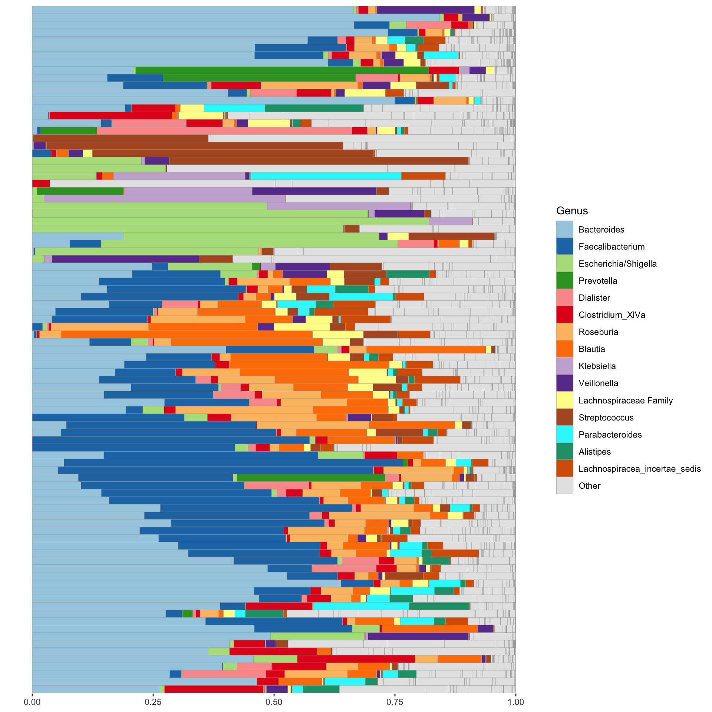
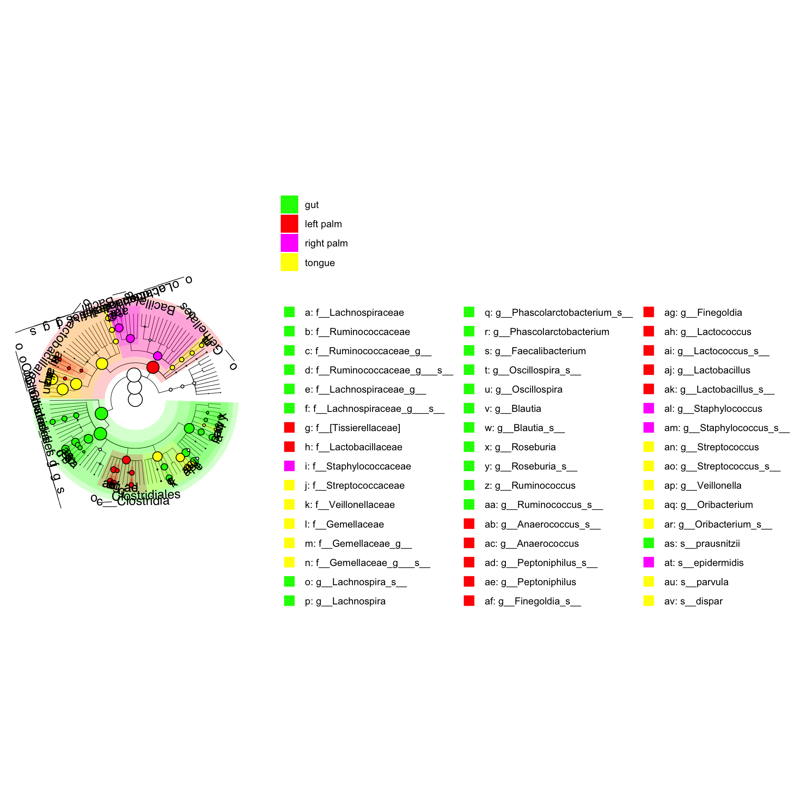

# Exploration of processded data


```r
library(tidyverse)
```

```
## ── Attaching core tidyverse packages ──────────────────────── tidyverse 2.0.0 ──
## ✔ dplyr     1.1.4     ✔ readr     2.1.5
## ✔ forcats   1.0.0     ✔ stringr   1.5.1
## ✔ ggplot2   3.4.4     ✔ tibble    3.2.1
## ✔ lubridate 1.9.3     ✔ tidyr     1.3.1
## ✔ purrr     1.0.2     
## ── Conflicts ────────────────────────────────────────── tidyverse_conflicts() ──
## ✖ dplyr::filter() masks stats::filter()
## ✖ dplyr::lag()    masks stats::lag()
## ℹ Use the conflicted package (<http://conflicted.r-lib.org/>) to force all conflicts to become errors
```

```r
library(phyloseq)
library(microbiome)
```

```
## 
## microbiome R package (microbiome.github.com)
##     
## 
## 
##  Copyright (C) 2011-2022 Leo Lahti, 
##     Sudarshan Shetty et al. <microbiome.github.io>
## 
## 
## Attaching package: 'microbiome'
## 
## The following object is masked from 'package:ggplot2':
## 
##     alpha
## 
## The following object is masked from 'package:base':
## 
##     transform
```

```r
library(microbiomeMarker)
```

```
## Registered S3 method overwritten by 'gplots':
##   method         from     
##   reorder.factor DescTools
## 
## Attaching package: 'microbiomeMarker'
## 
## The following objects are masked from 'package:microbiome':
## 
##     abundances, aggregate_taxa
## 
## The following object is masked from 'package:phyloseq':
## 
##     plot_heatmap
```

```r
source("workflow/scripts/importdata.R")
```

```
## 
## Attaching package: 'Matrix'
## 
## The following objects are masked from 'package:tidyr':
## 
##     expand, pack, unpack
```


## Import data

```
Loading objects:
  df_GlobalPatterns
  df_ibd_phylo
  df_dietswap
  df_caporaso
  df_kostic_crc
  ps_GlobalPatterns
  ps_ibd_phylo
  ps_dietswap
  ps_caporaso
  ps_kostic_crc
```


## Dataset: `ps_GlobalPatterns`

```
phyloseq-class experiment-level object
otu_table()   OTU Table:         [ 19216 taxa and 26 samples ]
sample_data() Sample Data:       [ 26 samples by 7 sample variables ]
tax_table()   Taxonomy Table:    [ 19216 taxa by 7 taxonomic ranks ]
phy_tree()    Phylogenetic Tree: [ 19216 tips and 19215 internal nodes ]
```

```

Sample Variables
```

```
[1] "X.SampleID"               "Primer"                  
[3] "Final_Barcode"            "Barcode_truncated_plus_T"
[5] "Barcode_full_length"      "SampleType"              
[7] "Description"             
```

```

Number of levels in selected group
```

```
[1] 1 2 3 4 5 6 7 8 9
```

## Dataset: `ps_ibd_phylo`

```
phyloseq-class experiment-level object
otu_table()   OTU Table:         [ 36349 taxa and 91 samples ]
sample_data() Sample Data:       [ 91 samples by 15 sample variables ]
tax_table()   Taxonomy Table:    [ 36349 taxa by 7 taxonomic ranks ]
```

```

Sample Variables
```

```
 [1] "sample"       "gender"       "age"          "DiseaseState" "steroids"    
 [6] "imsp"         "abx"          "mesalamine"   "ibd"          "activity"    
[11] "active"       "race"         "fhx"          "imspLEVEL"    "SampleType"  
```

```

Number of levels in selected group
```

```
[1] 1 2 3 4
```




## Dataset: `ps_dietswap`

```
phyloseq-class experiment-level object
otu_table()   OTU Table:         [ 130 taxa and 222 samples ]
sample_data() Sample Data:       [ 222 samples by 8 sample variables ]
tax_table()   Taxonomy Table:    [ 130 taxa by 3 taxonomic ranks ]
```

```

Sample Variables
```

```
[1] "subject"                "sex"                    "nationality"           
[4] "group"                  "sample"                 "timepoint"             
[7] "timepoint.within.group" "bmi_group"             
```

```

Number of levels in nationality
```

```
[1] 1 2
```

```

Number of levels in group
```

```
[1] 1 2 3
```


## Dataset: `ps_caporaso`

```
phyloseq-class experiment-level object
otu_table()   OTU Table:         [ 3426 taxa and 34 samples ]
sample_data() Sample Data:       [ 34 samples by 8 sample variables ]
tax_table()   Taxonomy Table:    [ 3426 taxa by 7 taxonomic ranks ]
phy_tree()    Phylogenetic Tree: [ 3426 tips and 3424 internal nodes ]
```

```

Sample Variables
```

```
[1] "SampleType"               "Year"                    
[3] "Month"                    "Day"                     
[5] "Subject"                  "ReportedAntibioticUsage" 
[7] "DaysSinceExperimentStart" "Description"             
```

```

Number of levels in selected group
```

```
[1] 1 2 3 4
```





## Dataset: `ps_kostic_crc`

```
phyloseq-class experiment-level object
otu_table()   OTU Table:         [ 2505 taxa and 177 samples ]
sample_data() Sample Data:       [ 177 samples by 71 sample variables ]
tax_table()   Taxonomy Table:    [ 2505 taxa by 7 taxonomic ranks ]
```

```

Sample Variables
```

```
 [1] "X.SampleID"                    "BarcodeSequence"              
 [3] "LinkerPrimerSequence"          "NECROSIS_PERCENT"             
 [5] "TARGET_SUBFRAGMENT"            "ASSIGNED_FROM_GEO"            
 [7] "EXPERIMENT_CENTER"             "TITLE"                        
 [9] "RUN_PREFIX"                    "AGE"                          
[11] "NORMAL_EQUIVALENT_PERCENT"     "FIBROBLAST_AND_VESSEL_PERCENT"
[13] "DEPTH"                         "TREATMENT"                    
[15] "AGE_AT_DIAGNOSIS"              "COMMON_NAME"                  
[17] "HOST_COMMON_NAME"              "BODY_SITE"                    
[19] "ELEVATION"                     "REPORTS_RECEIVED"             
[21] "CEA"                           "PCR_PRIMERS"                  
[23] "COLLECTION_DATE"               "ALTITUDE"                     
[25] "ENV_BIOME"                     "SEX"                          
[27] "PLATFORM"                      "RACE"                         
[29] "BSP_DIAGNOSIS"                 "STUDY_CENTER"                 
[31] "COUNTRY"                       "CHEMOTHERAPY"                 
[33] "YEAR_OF_DEATH"                 "ETHNICITY"                    
[35] "ANONYMIZED_NAME"               "TAXON_ID"                     
[37] "SAMPLE_CENTER"                 "SAMP_SIZE"                    
[39] "YEAR_OF_BIRTH"                 "ORIGINAL_DIAGNOSIS"           
[41] "AGE_UNIT"                      "STUDY_ID"                     
[43] "EXPERIMENT_DESIGN_DESCRIPTION" "Description_duplicate"        
[45] "DIAGNOSIS"                     "BODY_HABITAT"                 
[47] "SEQUENCING_METH"               "RUN_DATE"                     
[49] "HISTOLOGIC_GRADE"              "LONGITUDE"                    
[51] "ENV_MATTER"                    "TARGET_GENE"                  
[53] "ENV_FEATURE"                   "KEY_SEQ"                      
[55] "BODY_PRODUCT"                  "TUMOR_PERCENT"                
[57] "LIBRARY_CONSTRUCTION_PROTOCOL" "REGION"                       
[59] "RUN_CENTER"                    "TUMOR_TYPE"                   
[61] "BSP_NOTES"                     "RADIATION_THERAPY"            
[63] "INFLAMMATION_PERCENT"          "HOST_SUBJECT_ID"              
[65] "PC3"                           "LATITUDE"                     
[67] "OSH_DIAGNOSIS"                 "STAGE"                        
[69] "PRIMARY_DISEASE"               "HOST_TAXID"                   
[71] "Description"                  
```

```

Number of levels in DIAGNOSIS
```

```
[1] 1 2
```


```
           Df  SumOfSqs         R2        F Pr(>F)
bmi_group   2  104.0678 0.04177157 4.773379   0.01
Residual  219 2387.2862 0.95822843       NA     NA
Total     221 2491.3540 1.00000000       NA     NA
```

```
psExtra info:
tax_agg = "Family" tax_trans = "identity" dist_method = "aitchison" 
```


## Plot ggtree cladogram


```
Loading objects:
  df_GlobalPatterns
  df_ibd_phylo
  df_dietswap
  df_caporaso
  df_kostic_crc
  ps_GlobalPatterns
  ps_ibd_phylo
  ps_dietswap
  ps_caporaso
  ps_kostic_crc
```


## Getting `otutable` from phyloseq


## Getting Bray-`Curtis` distances


## Getting `Jaccard` distances


