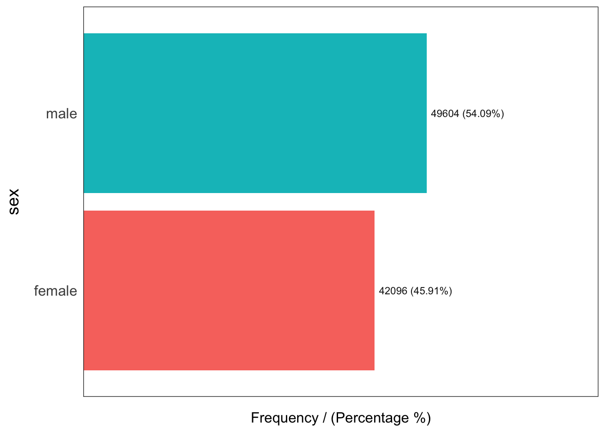
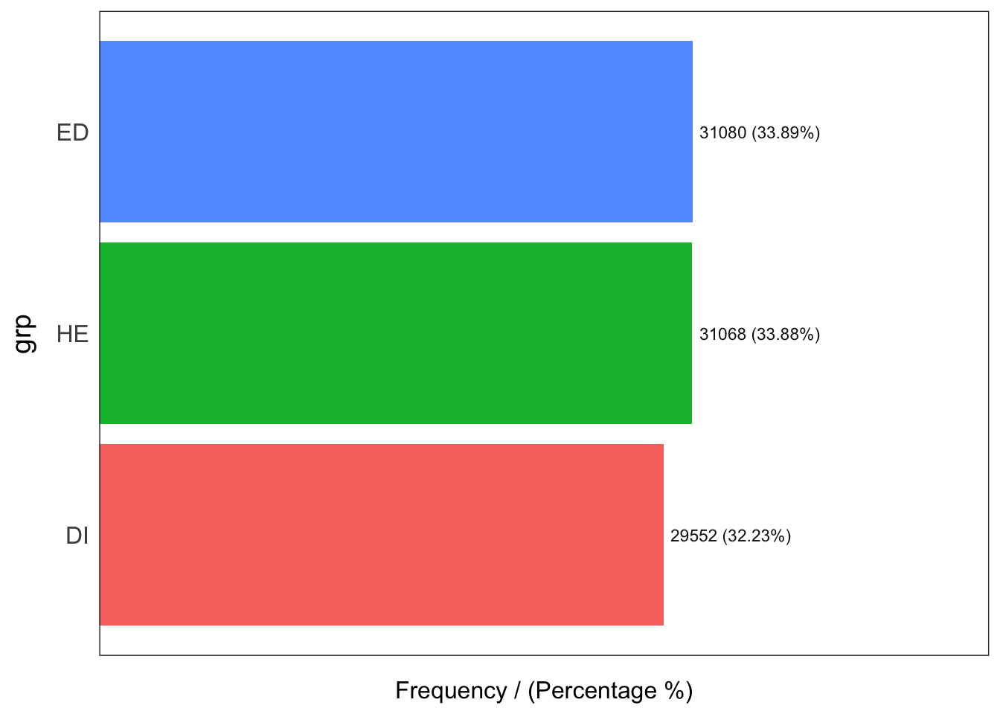
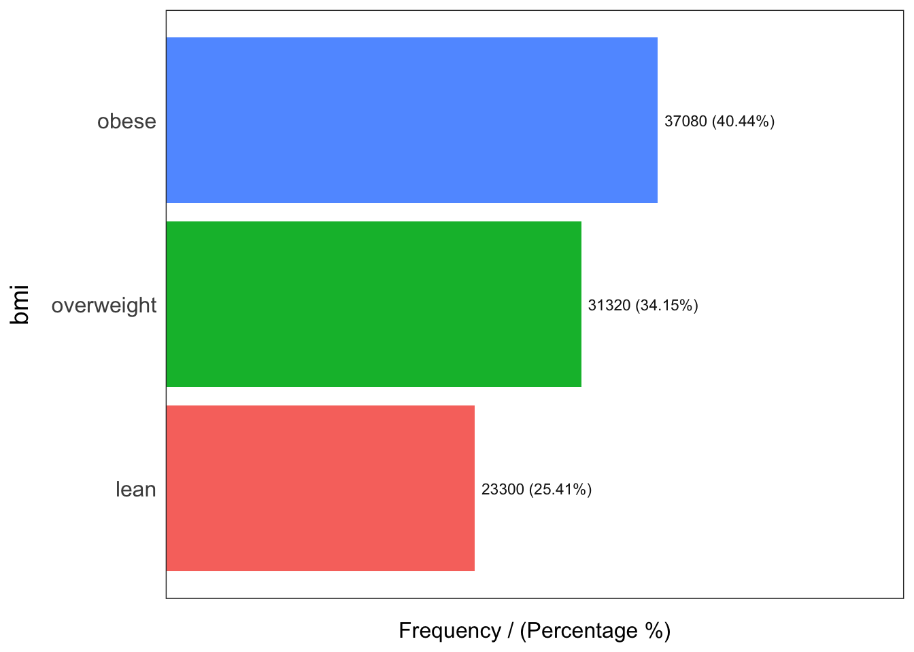
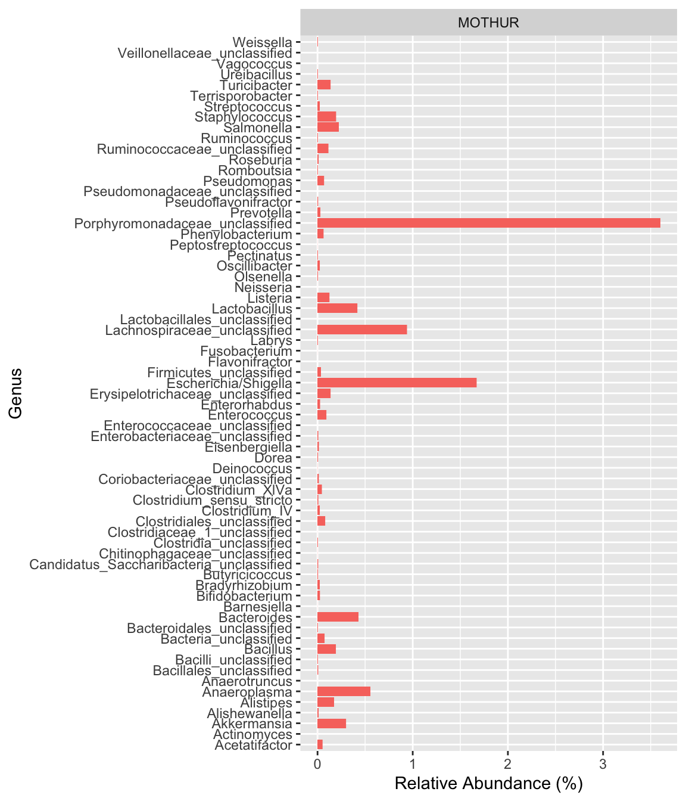
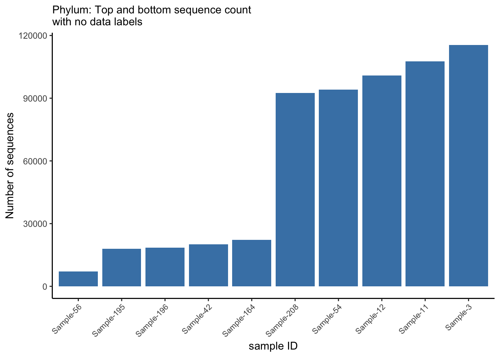
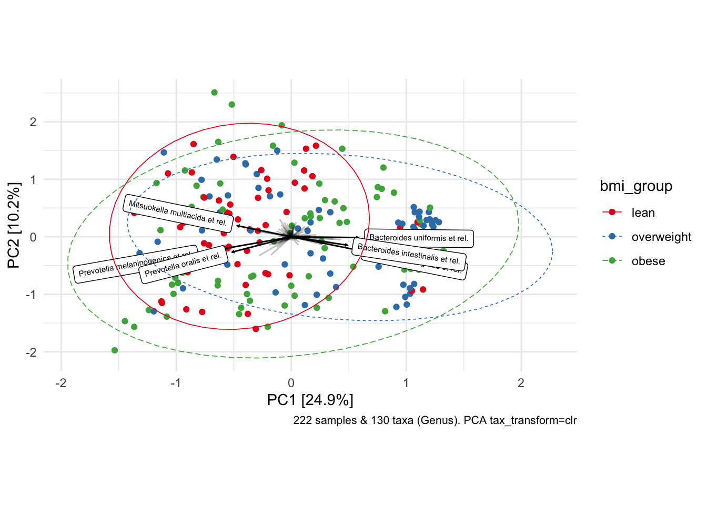
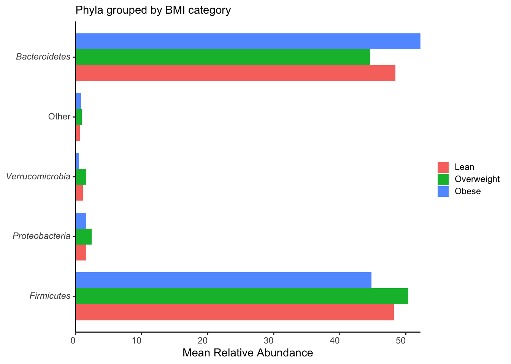

# (PART) START EXPLORING {-}

# Exploration of Visualization Types


## Import data

```r
# Load required packages
library(phyloseq)
library(tidyverse)

cat("\nSaved RData objects\n\n")
```

```

Saved RData objects
```

```r
load("data/external_ps_objects.rda", verbose = T)
```

```
Loading objects:
  df_GlobalPatterns
  df_dietswap
  df_caporaso
  df_kostic_crc
  ps_GlobalPatterns
  ps_dietswap
  ps_caporaso
  ps_kostic_crc
```

```r
load("data/ps_transformed.rda", verbose = T)
```

```
Loading objects:
  ps_asin
  ps_identity
  ps_compositional
  ps_z_otu
  ps_z_sample
  ps_log10
  ps_log10p
  ps_clr
  ps_shift
  ps_scale
```

```r
load("data/bray_distances.rda", verbose = T)
```

```
Loading objects:
  ps_asin_bray_dist
  ps_compositional_bray_dist
  ps_z_otu_bray_dist
  ps_z_sample_bray_dist
  ps_log10_bray_dist
  ps_log10p_bray_dist
  ps_clr_bray_dist
  ps_shift_bray_dist
  ps_scale_bray_dist
```

```r
load("data/psextra_distances.rda", verbose = T)
```

```
Loading objects:
  psextra_clr_asin_bray_dist
  psextra_id_asin_bray_dist
  psextra_log10p_asin_bray_dist
```

```r
load("data/reduced_dimension.rda", verbose = T)
```

```
Loading objects:
  pca_asin_bray_metrics
  mds_asin_bray_metrics
  pcoa_asin_bray_metrics
  tsne_asin_bray_metrics
```

```r
load("data/phyloseq_extra_objects.rda", verbose = T)
```

```
Loading objects:
  psextra_clr_dietswap
  psextra_id_dietswap
  psextra_log10p_dietswap
```


## Major visualization R colors
In R, there are several built-in palettes that we can use for color schemes in plots. Some commonly used palettes include:


```
[1] "#66C2A5" "#FC8D62" "#8DA0CB" "#E78AC3" "#A6D854" "#FFD92F" "#E5C494"
[8] "#B3B3B3"
```

```
[1] "#B3B3B3" "#E5C494" "#FFD92F" "#A6D854" "#E78AC3" "#8DA0CB" "#FC8D62"
[8] "#66C2A5"
```

```
[1] "#440154FF" "#46337EFF" "#365C8DFF" "#277F8EFF" "#1FA187FF" "#4AC16DFF"
[7] "#9FDA3AFF" "#FDE725FF"
```

```
[1] "#FDE725FF" "#9FDA3AFF" "#4AC16DFF" "#1FA187FF" "#277F8EFF" "#365C8DFF"
[7] "#46337EFF" "#440154FF"
```

```
[1] "#FF0000" "#FFBF00" "#80FF00" "#00FF40" "#00FFFF" "#0040FF" "#8000FF"
[8] "#FF00BF"
```

```
[1] "#FF00BF" "#8000FF" "#0040FF" "#00FFFF" "#00FF40" "#80FF00" "#FFBF00"
[8] "#FF0000"
```

> - **viridis**: A perceptually uniform and colorblind-friendly palette.
> - **magma**: A palette with a dark-to-light color scheme.
> - **inferno**: A palette with a light-to-dark color scheme.
> - **plasma**: A palette with a dark-to-light color scheme.
> - **cool**: A palette with cool colors.
> - **hot**: A palette with hot colors.
> - **terrain.colors**: A palette with colors resembling a terrain map.
> - **rainbow**: A palette with colors of the rainbow.
> - **heat.colors**: A palette with colors ranging from dark red to yellow.
> 
> - In ggpubr: "npg", "aaas", "lancet", "jco", "ucscgb", "uchicago", "simpsons" and "rickandmorty".


## Major visualization techniques {#visual-types}
Below are some of the key visualization techniques used in microbiome research, along with their descriptions and the corresponding tools in R.


| Visual Type | Description |
|-------|-------------|
| Barplots | Display the relative abundances of different taxa across groups. |
| Heatmaps | Represent the abundance or presence/absence of taxa across samples. |
| Scatter plots | Useful for visualizing relationships between numerical variables |
| Box plots | Summarize the distribution of a variable |
| PCA plots | Dimensionality reduction technique for visualizing similarities or dissimilarities between samples based on their microbial composition |
| Alpha diversity plots | Measure the diversity within a sample, e.g. rarefaction plot |
| Beta diversity plots | Measure the dissimilarity between samples, e.g. PCoA ordination |
| Line plot | Visualize changes in the abundance of specific taxa over time or across different conditions. |
| Network plots | Depict interactions or associations between taxa|
| Volcano plots | Identify statistically significant differences in abundance between groups |
| Correlation plots | Visualize correlations between taxa or between taxa and metadata variables |
| UpSet plots | Display intersections of sets and their size in a matrix layout |
| Venn diagrams | Show overlap between taxa or groups |
| Differential abundance plots | Visualize differences in abundance between groups while controlling for confounding factors |
| Indicator species analysis plots | Identify taxa associated with specific groups or conditions |


# (PART) BAR CHARTS {-}

# Bar Plots 

Bar plots are commonly used to visualize the relative abundance of taxa or other features within different groups or conditions in microbiome data. In this section, we will demonstrate different methods for plotting bar plots.

## Using freq() to explore sample metadata
The freq() function is in the funModeling package provides a concise summary of the frequency distribution of a categorical variable in a dataset. It displays the count and percentage of each category, allowing users to quickly understand the distribution and prevalence of different categories within the variable. This function is useful for exploratory data analysis and understanding the composition of categorical variables in the dataset.


```r
library(phyloseq)
library(dplyr)
library(microbiome)
library(funModeling)

df <-df_dietswap %>% 
  select(-sample) %>% 
  rename_all(tolower)

freq(df, 
     input = c("sex", "nationality", "group", "bmi_group"), 
     plot = TRUE,
     na.rm = FALSE, 
     # path_out="figures"
     )
```



```
     sex frequency percentage cumulative_perc
1   male     15600      54.05           54.05
2 female     13260      45.95          100.00
```


```
  nationality frequency percentage cumulative_perc
1         AAM     15990      55.41           55.41
2         AFR     12870      44.59          100.00
```



```
  group frequency percentage cumulative_perc
1    ED      9750      33.78           33.78
2    HE      9750      33.78           67.56
3    DI      9360      32.43          100.00
```



```
   bmi_group frequency percentage cumulative_perc
1      obese     11700      40.54           40.54
2 overweight      9880      34.23           74.77
3       lean      7280      25.23          100.00
```

```
[1] "Variables processed: sex, nationality, group, bmi_group"
```


## Relative abundance of taxa
- Using `comp_barplot` function in microViz package

The `comp_barplot` function in the `microViz` R package is designed to create comparative bar plots for visualizing microbiome data. This function allows users to compare the relative abundance of taxa or other features across different groups or conditions. It supports customization options such as color palette selection and plot title specification to enhance the appearance of the bar plot. 


```r
library(microViz)

ps_dietswap %>%
  comp_barplot(
    tax_level = "Genus", n_taxa = 15, other_name = "Other",
    taxon_renamer = function(x) stringr::str_remove(x, " [ae]t rel."),
    palette = distinct_palette(n = 15, add = "grey90"),
    merge_other = FALSE, bar_outline_colour = "darkgrey"
  ) +
  coord_flip() +
  facet_wrap("nationality", nrow = 1, scales = "free") +
  labs(x = NULL, y = NULL) +
  theme(axis.text.y = element_blank(), axis.ticks.y = element_blank())
```


# (PART) DIFFERENTIAL ABUNDANCE {-}

# Differential Analysis of Microbiome Data 

Differential abundance analysis is a fundamental technique in microbiome research used to identify features that exhibit significant differences in abundance across different biological conditions or treatments. This analysis is crucial for understanding the dynamics of microbial communities and their response to various environmental factors. In this section, we will explore different methods for conducting differential abundance analysis using microbiome data.

## Using run_lefse() in microbiomeMaker Package

The `run_lefse()` function in the `microbiomeMaker` R package provides a convenient method for performing Differential Abundance Analysis on microbiome data. By leveraging the Linear Discriminant Analysis Effect Size (LEfSe) algorithm, `run_lefse()` enables researchers to interpret the results in the context of biological class labels, uncovering important insights into microbial community dynamics.

**Dataset: dietswap**

```r
library(phyloseq)
library(microbiomeMarker)

# Run LEfSe analysis
run_lefse(
  ps_dietswap,
  wilcoxon_cutoff = 0.0001,
  group = "nationality",
  taxa_rank = "Genus",
  transform = "log10p",
  kw_cutoff = 0.01,
  multigrp_strat = TRUE,
  lda_cutoff = 2
) %>% 
plot_heatmap(group = "nationality", color = "viridis")
```


**Dataset: caporaso**

```r
library(microbiomeMarker)

ps_caporaso <- ps_caporaso %>%  tax_fix()

run_lefse(
    ps_caporaso, 
    wilcoxon_cutoff = 0.001,
    group = "SampleType",
    taxa_rank = "Genus",
    transform = "log10p",
    kw_cutoff = 0.01,
    multigrp_strat = TRUE,
    lda_cutoff = 2) %>%
  plot_heatmap(group = "SampleType", color = "viridis_r")
```


```r
library(microViz)

ps_caporaso %>%
  tax_fix() %>% 
  comp_barplot(
    tax_level = "Genus", n_taxa = 15, other_name = "Other",
    taxon_renamer = function(x) stringr::str_remove(x, " [ae]t rel."),
    palette = distinct_palette(n = 15, add = "grey90"),
    merge_other = FALSE, bar_outline_colour = "darkgrey"
  ) +
  coord_flip() +
  facet_wrap("SampleType", nrow = 1, scales = "free") +
  labs(x = NULL, y = NULL) +
  theme(axis.text.y = element_blank(), axis.ticks.y = element_blank())
```




## Cladogram using plot_cladogram()


```r
kostic_crc_small <- phyloseq::subset_taxa(
    ps_kostic_crc,
    Phylum %in% c("Firmicutes")
)
mm_lefse <- run_lefse(
    kostic_crc_small,
    wilcoxon_cutoff = 0.01,
    group = "DIAGNOSIS",
    kw_cutoff = 0.01,
    multigrp_strat = TRUE,
    lda_cutoff = 4
)
plot_cladogram(mm_lefse, color = c("darkgreen", "red"))
```


```r
library(microViz)

htmp <- ps_dietswap %>%
  ps_mutate(nationality = as.character(nationality)) %>%
  tax_transform("log2", add = 1, chain = TRUE) %>%
  comp_heatmap(
    taxa = tax_top(ps_dietswap, n = 30), grid_col = NA, name = "Log2p",
    taxon_renamer = function(x) stringr::str_remove(x, " [ae]t rel."),
    colors = heat_palette(palette = viridis::turbo(11)),
    row_names_side = "left", row_dend_side = "right", sample_side = "bottom",
    sample_anno = sampleAnnotation(
      Nationality = anno_sample_cat(
        var = "nationality", col = c(AAM = "grey35", AFR = "grey85"),
        box_col = NA, legend_title = "Nationality", size = grid::unit(4, "mm")
      )
    )
  )

ComplexHeatmap::draw(
  object = htmp, annotation_legend_list = attr(htmp, "AnnoLegends"),
  merge_legends = TRUE
)
```




# (PART) ORDINATION {-}

# Ordination Plots

## Ordination with auto caption


```r
library(microViz)

# perform ordination
pca_plot <- psextra_clr_dietswap %>%
  ord_calc(method = "PCA") %>%
  ord_plot(
    plot_taxa = 1:6, colour = "bmi_group", size = 1.5,
    tax_vec_length = 0.325,
    tax_lab_style = tax_lab_style(max_angle = 90, aspect_ratio = 0.5),
    auto_caption = 8
  )
```

## Customizing an ordination plot

```r
library(ggplot2)

# customise plot
customised_plot <- pca_plot +
  stat_ellipse(aes(linetype = bmi_group, colour = bmi_group), linewidth = 0.3) + # linewidth not size, since ggplot 3.4.0
  scale_colour_brewer(palette = "Set1") +
  theme(legend.position = "right") +
  coord_fixed(ratio = 0.5, clip = "off") # makes rotated labels align correctly

# show plot
customised_plot
```




# (PART) RELATIONSHIP ANALYSIS {-}

# Patterns and Associations Analysis

In this section, we will explore methods for analyzing patterns and associations within datasets. These methods are instrumental in uncovering relationships between variables, identifying underlying patterns, and elucidating complex structures within the data. Specifically, we will discuss correlation analysis, heatmap visualization, hierarchical clustering, and other techniques for exploring patterns and associations in various types of datasets.

## Correlation analysis and visualization

Correlation analysis quantifies the strength and direction of the linear relationship between two continuous variables. It helps in understanding how variables are related to each other and can identify potential associations or dependencies within the data. Heatmap visualization is commonly integrated with correlation analysis to visually represent correlation matrices, allowing for the identification of patterns and relationships between variables.


### Pearson Correlation Heatmap with microViz Package
In this section, we utilize the cor_heatmap function available in the microViz package to generate a heatmap visualizing Pearson correlation coefficients between variables. This technique allows for the exploration of relationships and patterns within the data, providing insights into the strength and direction of linear associations between variables.


```r
ps_extra <- ps_dietswap %>%
tax_transform(
  trans = "clr",
  rank = "Genus",
  keep_counts = TRUE,
  zero_replace = 0,
  add = 0,
  transformation = NULL
)
```


```r
# Load required packages
library(phyloseq)
library(microViz)

# Set up the data with numerical variables and filter to top taxa
ps <- ps_dietswap %>%
  ps_mutate(
    bmi = recode(bmi_group, obese = 3, overweight = 2, lean = 1),
    female = if_else(sex == "female", true = 1, false = 0),
    african = if_else(nationality == "AFR", true = 1, false = 0)
  ) %>%
  tax_filter(
    tax_level = "Genus", min_prevalence = 1 / 10, min_sample_abundance = 1 / 10
  ) %>%
  tax_transform("identity", rank = "Genus")

# Randomly select 30 taxa from the 50 most abundant taxa (just for demo)
set.seed(123)
top_taxa <- tax_top(ps_dietswap, n = 10, by = sum, rank = "unique", use_counts = FALSE)

taxa <- sample(tax_top(ps_dietswap, n = 50), size = 30)

# Clean the data and draw the correlation heatmap 
cor_heatmap(
  data = ps, 
  taxa = taxa,
  taxon_renamer = function(x) stringr::str_remove(x, " [ae]t rel."),
  tax_anno = taxAnnotation(
    Prev. = anno_tax_prev(undetected = 50),
    Log2 = anno_tax_box(undetected = 50, trans = "log2", zero_replace = 1)
  )
)
```


> Note: The parameter min_prevalence = 0.1 is set, equivalent to approximately 23 out of 222 samples. This value may vary depending on the dataset. Adjust as necessary.


## Hierarchical clustering

Hierarchical clustering is a method for grouping similar observations or variables together based on their similarity or dissimilarity. It creates a hierarchical tree-like structure (dendrogram) that illustrates the relationships between clusters, allowing for the identification of natural groupings or patterns within the data.


# (PART) PHYLOGENY ANALYSIS {-}

# Phylogenetic Analysis 

Phylogenetic analysis is essential in microbiome research for understanding the evolutionary relationships between microbial taxa. In this section, we will explore various tools and techniques for phylogenetic analysis. 

## View a tree by ape and ggtree R packages

```r
set.seed(1234)

library(ape)
library(ggtree)

tree <- rtree(20)
ggtree(tree)
```



## Cladogram using ggtree() function


```r
library(ape)
library(ggtree)


ggtree(
  phy_tree(ps_caporaso),
  mapping = NULL,
  layout = "circular",
  open.angle = 0,
  mrsd = NULL,
  as.Date = FALSE,
  yscale = "none",
  yscale_mapping = NULL,
  ladderize = TRUE,
  right = FALSE,
  branch.length = "branch.length",
  root.position = 0,
  xlim = NULL
)
```


